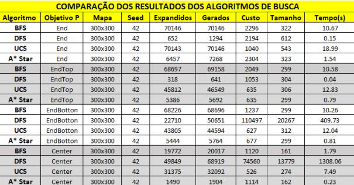

# ALGORISTIMOS DE BUSCA: BREADTH FIRST SEARCH, DEPTH FIRST SEARCH, UNIFORM COST SEARCH E A* SEARCH

<a href="https://youtu.be/wRlKJLQimsA">`Video demostração Youtube`</a>
#

# 

1. FUNDAMENTAÇÃO TEÓRICA

Busca em largura (BFS – Breadth-first search)
É uma estratégia simples em que o nó raiz é expandido primeiro, em seguida
todos os sucessores do nó raiz são expandidos, depois os sucessores desses nós, e
assim por diante. Em geral, todos os nós em dada profundidade na árvore de busca
são expandidos, antes que todos os nós no nível seguinte sejam expandidos.
A busca em largura é uma instância do algoritmo de busca em grafo, em que o
nó mais raso não expandido é escolhido para expansão. Isso é conseguido
simplesmente utilizando uma fila FIFO para a borda. Assim, novos nós (que são
sempre mais profundos do que seus pais) vão para o fim da fila, e nós antigos, que
são mais rasos que os novos, são expandidos primeiro. (RUSSELL;NORVIG, 2013).

Busca em profundidade (DFS – Depth-first search)
Ela sempre expande o nó mais profundo na borda atual da árvore de busca. O
progresso da busca é ilustrado na Figura 3.16. A busca prossegue imediatamente até
o nível mais profundo da árvore de busca, onde os nós não têm sucessores. À medida
que esses nós são expandidos, eles são retirados da borda e, então, a busca “retorna”
ao nó seguinte mais profundo que ainda tem sucessores inexplorados.
O algoritmo de busca em profundidade é uma instância do algoritmo de busca
em grafo; enquanto a busca em largura utiliza uma fila FIFO, a busca em profundidade
utiliza uma fila LIFO. Uma fila LIFO significa que o nó gerado mais recentemente é
escolhido para expansão (RUSSELL;NORVIG, 2013).

Busca de Custo Uniforme
Quando todos os custos de passos forem iguais, a busca em largura será ótima
porque sempre expande o nó mais raso não expandido. Através de uma simples
extensão, podemos encontrar um algoritmo que é ótimo para qualquer função de custo
do passo. Em vez de expandir o nó mais raso, a busca de custo uniforme expande o
nó n com o custo de caminho g(n) mais baixo. Isso é feito através do armazenamento
da borda como uma fila de prioridade ordenada por g.
Busca de custo uniforme em um grafo. O algoritmo é idêntico ao algoritmo geral
de busca de grafo, exceto pelo uso de uma fila de prioridade e pela adição de uma
verificação extra, caso um caminho mais curto para um estado de borda seja
descoberto. A estrutura de dados para a borda deve permitir os testes eficientes de
pertinência em conjunto, por isso deve combinar os recursos de uma fila de prioridade
e de uma tabela hash.(RUSSELL;NORVIG, 2013).

Busca de A* Estrela
A forma de solução mais amplamente conhecida da busca de melhor escolha
é chamada de busca A* (pronuncia-se “busca A estrela”). Ela avalia os nós através da
combinação de g(n), o custo para alcançar o nó, e h(n), o custo para ir do nó ao
objetivo: f(n) = g(n) + h(n).
(RUSSELL;NORVIG, 2013).

2. METODOLOGIA
AMBIENTE DO EXPERIMENTO
A Figura 1, exibi a configuração do computador utilizado no experimente, sendo
sistema de operacional Windows 10, com uma CPU AMD FX-6300 e memória RAM
de 16 GB DDR3 e Placa de Vídeo Geforce GTX 1050 TI.
Figura 1 – Configuração de PC - gerado pelo software Speccy
CONFIGURAÇÃO DA BUSCA
Os algoritmos de busca utilizaram as seguintes configurações inícios:
• Mapa= 300x300
• Seed= 42
Foi utilizado um sistema de posição para o objetivo visando obter melhores
resultados, o sistema varia em 4 posições:
• Posição 1 - End – X = N e Y = N (padrão do template)
• Posição 2 - EndTop – X = 1 e Y = N
• Posição 3 - EndBotton – X = N e Y = 1
• Posição 4 - Center – X= N/2 e Y = N/2
Cada Algoritmo foi testado mais de 50 vezes e retirado uma média de tempo
de execução.
Obs. Algoritmo DFS na posição 3 e 4, foram testados apenas 5 vezes cada,
devido ao alto tempo de execução.
Foi feita algumas alterações no template original a função step_cost que utiliza
a cell_distance foi alterada com objetivo de melhorar o resultado no custo,
tendo com custo resultante agora 1 para ligação em vertical ou horizontal, custo
de 8 para ligações na diagonal.

3. RESULTADOS
A tabela 1 demostra os resultados das medias de todas as buscas em suas
variações de acordo com a posição do objetivo no labirinto. Na tabela as linhas são os
algoritmos e colunas são as métricas, assim como foi solicitado no enunciado do
trabalho.
Tabela1 – fonte: própria.
ANÁLISE DA BUSCA EM PROFUNDIDADE (DFS)
O DFS obteve o melhor tempo de todos com incríveis 0,04s de média na
disposição EndTop, mas ele também obteve os piores tempos de todos, na disposição
Center aproximadamente 22 minutos, e na disposição End aproximadamente 7
minutos. Em relação ao tamanho do caminho ele é o pior, em quase todas as
disposições, salvo apenas na disposição EndTop onde o objetivo se apresenta na
ramificação inicial da profundidade. Em relação ao custo do caminho o DFS
apresentou a pior média entre todos algoritmos.
Referente aos nós expandidos e gerados, ele tem as menos marcas de todos
algoritmos na disposição EndTop e End, mas em contra partida o tem as piores mais
na disposição Center e EndBotton, ainda como ocorreu com o tempo de execução,
nos levando a concluir q essas grandes são proporcionais.
O DFS pode ser a melhor a opção em casos onde o objetivo está na ramificação
inicial pesquisada e se a prioridade for tempo de execução e consumo de memória,
fora isso não é melhor opção, em casos onde não há conhecimento do ambiente não
é p mais indicado.
ANÁLISE DA BUSCA EM LARGURA (BFS)
O BFS tem como seu ponto forte o tamanho do caminho, ele sempre vai
encontrar a reposta com o menor caminho, e se os caminhos tiverem custos iguais a
solução encontrada será ótima, ele é melhor opção quando não tem o conhecimento
do ambiente visto que ele verifica todos os nós, seu ponto fraco é o alto consumo de
memória.
ANÁLISE DA BUSCA DE CUSTO UNIFORME
Essa busca tem como ponto forte o custo, como foi previsto as alterações no
custo do template fora importante para diferenciar melhor essa busca, com o BFS ou
A*, pois quase não havia variância nos resultados, ao mudar o custo foi perceptível a
eficácia desse algoritmo com relação ao custo.
Sua principal desvantagem é o tempo de execução e o alto consumo da
memória, além de visitar todos os nós como o BFS ele também necessita analisar o
custo de todos os nós.
Essa busca é a melhor opção quando objetivo seja o caminho com menor custo.
ANÁLISE DA BUSCA A*
Essa busca é a mais completa dos algoritmos analisados, como já era
esperado, no meu algoritmo priorizei o tempo de execução, mas ele é variável em sua
implementação como ele tem uma função baseada na soma dos custos do caminho
mais a heurística, pode ser feito uma variância na implementação, quando priorizar o
valor custo, ele tem uma melhorar no custo e tamanho, mas tem um aumento na
quantidade nós e no tempo de execução.
Na função implementa foi adicionado um fator de otimização à heurística,
observou um ganho aproximado de 90% no tempo e na quantidade nós, e tento um
aumento no tamanho de menos de 0,5%.

A imagem mostra os resultados antes do fator de otimização
Após utiliza o fator de otimização
Sua principal desvantagem é que ele necessita de um conhecimento prévio do
objetivo para o cálculo da heurística.
ANÁLISE DA BUSCA ITERATIVE DEEPENING DEPTH FIRST SEACH (IDDFS)
Essa busca é uma variação do BFS e DFS, pois ela trabalha com nível de
profundidade na sua busca, seu ponto forte é o consumo de memória, mais seu tempo
de execução se mostrou alto, na verdade ele executa a mesma busca varias vezes
passado um limite maior de profundidade a cada execução, outro fator positivo que
esse algoritmo consegue encontrar uma solução, coisa que o DFS pode não fazer em
alguns caso.
A figura abaixo mostra a analise do IDDFS com relação as outros buscas
analisadas:

4. REFERÊNCIAS
RUSSELL, S. J.; NORVIG, P. Inteligência artificial. 3. ed. Rio de Janeiro: Elsevier, 2013. 988 p.
